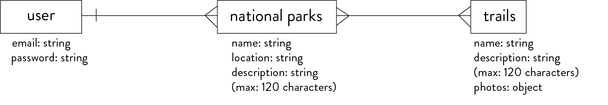

# My-national-park-server

## Summary
This full stack application is designed for users keeping track of their experience in national parks they have visited.

Once user signed up and/or signed in, user can add parks they visited. User can update or delete each park. They can also change password and sign out under the profile dropdown menu.

## Important Links
https://tiffyyc.github.io/my-national-parks-client/

## ERD Diagram
